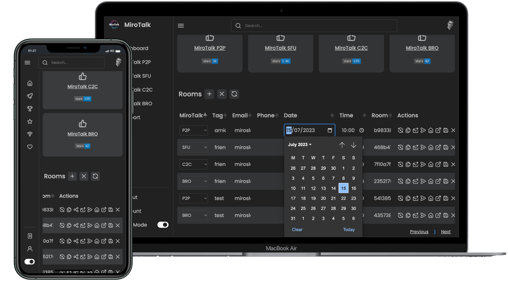

# MiroTalk CI/CD pipeline

Deploy MiroTalk server with CI/CD on Elestio

 
 

# Once deployed ...

You can open MiroTalk UI here:

    URL: https://[CI_CD_DOMAIN]
    email: [ADMIN_EMAIL]
    login: admin
    password: [ADMIN_PASSWORD]

# Custom domain instructions (IMPORTANT)

By default, we set up a CNAME on elestio.app domain, but probably you will want to have your own domain.

***Step1:*** Add your domain in the Elestio dashboard as explained here:

    https://docs.elest.io/books/security/page/custom-domain-and-automated-encryption-ssltls

***Step2:*** Modify the environment variables and configuration settings to incorporate your personalized domain. Open the Elestio dashboard -> Navigate to Service > Tools > Launch VS Code, then proceed to edit the domain in the ENV and Config files. Within the ENV File, substitute the existing values of `SERVER_HOST` and `SERVER_URL` with your specified domain. Additionally, within the config/config.js file, replace all instances of the elestio.app domain with your chosen custom domain.

***Step3:*** Open Terminal and run the command:

      docker-compose down;
      docker-compose up -d
